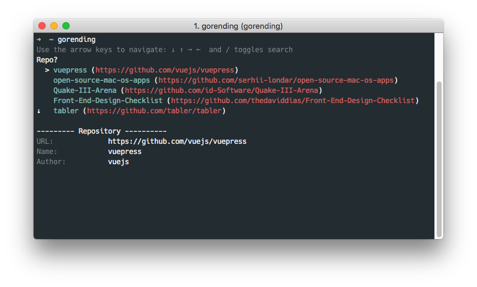

<br><br>

<h1 align="center">Gorending</h1>

<p align="center">
    <a href="https://goreportcard.com/report/github.com/Leop0ld/gorending" target="_blank">
        
    </a>
    <a href="https://godoc.org/github.com/Leop0ld/gorending" target="_blank">
        
    </a>
    <a href="https://travis-ci.org/Leop0ld/gorending">
        
    </a>
    <a href="https://raw.githubusercontent.com/Leop0ld/gorending/master/LICENSE">
        
    </a>
</p>

<br><br>



Installation
---

Write into your `.bashrc` or `.zshrc`;
```shell
export GOPATH=$HOME/go
export GOBIN=$GOPATH/bin
export PATH=$PATH:$GOBIN
```

And then;
```shell
$ source ~/.zshrc # or ~/.bashrc
$ go get -u github.com/leop0ld/gorending
```

#### Dependencies

- [github.com/urfave/cli](https://github.com/urfave/cli)
- [github.com/PuerkitoBio/goquery](https://github.com/PuerkitoBio/goquery)
- [github.com/manifoldco/promptui](https://github.com/manifoldco/promptui)
- [github.com/skratchdot/open-golang/open](https://github.com/skratchdot/open-golang/open)

Example
---
If you want to see 5 repositories about golang in Github trending, type like below;

```shell
$ gorending --lang go --count 5
```

or 

```shell
$ gorending -L go -C 5
```

If you want to see 15 repositories about all languages in Github trending, type this;

```shell
$ gorending --count 15
```

or

```shell
$ gorending -C 15
```

And move cursor, input ENTER.

Then open default browser with selected tredings URL.
